# **Credit Risk Analysis**

## **Overview**
In this analysis, we will apply machine learning to analyze credit card risk.  As credit risk is an unbalanced classification problem, meaning good loans typically outnumber risky loans, we will use *imbalanced-learn* and *scikit-learn* libraries to create and analyze models using resampling.

We'll oversample (*RandomOverSampler* and *SMOTE*) and undersample (*ClusterCentroids*) the data then use *SMOTEENN* to combine the two.  We will then reduce bias by using *BalancedRandomForestClassifier* and *EasyEnsembleClassifier* to model out the credit risk.

## **Results**

1. Naive Random Oversampling

    - Balanced Accuracy Score: The score is low at 0.64.
        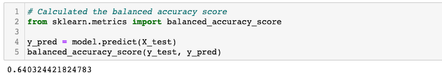

    - Imbalanced Classification Report: The precision score for high risk is very low at 0.01 and the recall scores are both low for high risk and low risk.
        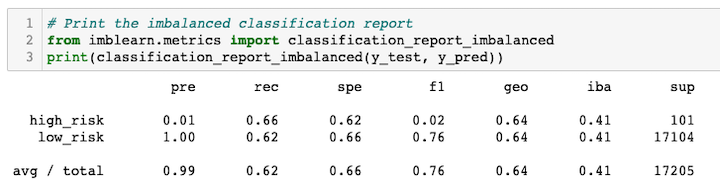

2. SMOTE Oversampling

    - Balanced Accuracy Score: The score is low at 0.65
        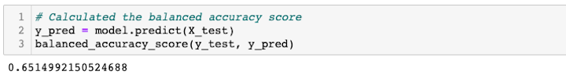

    - Imbalanced Classification Report: The precision score for high risk is very low at 0.01 and the recall scores are both low for high risk and low risk.
        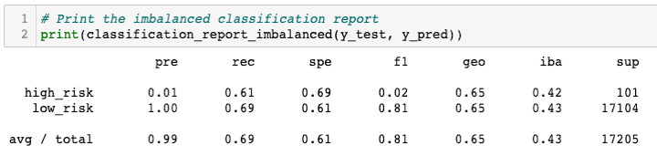

3. Cluster Centroids Undersampling

    - Balanced Accuracy Score: The score is low at 0.55
        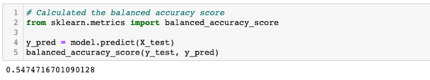

    - Imbalanced Classification Report: The precision score for high risk is very low at 0.01 and the recall score is low for high risk and very low risk.
        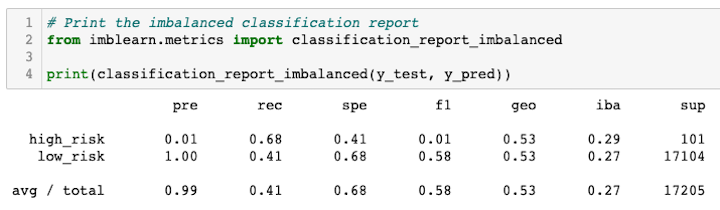

4. SMOTEENN Combination Sampling

    - Balanced Accuracy Score: The score is low at 0.64.
        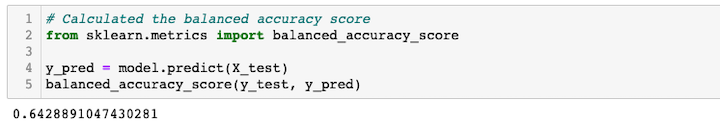

    - Imbalanced Classification Report: The precision score for high risk is very low at 0.01 and the recall score for high risk is decent at 0.71 but low for low risk at 0.57.
        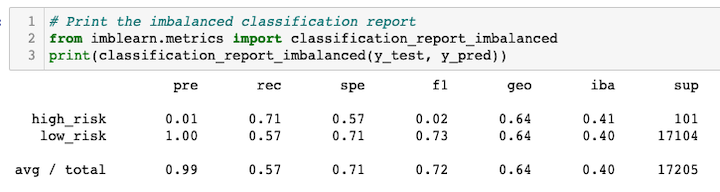

5. Balanced Random Forest Classifier

    - Balanced Accuracy Score: The score is decent at 0.79.
        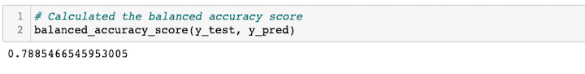

    - Imbalanced Classification Report: The precision score for high risk is very low at 0.03 whereas the recall scores are decent for both high risk and low risk.
        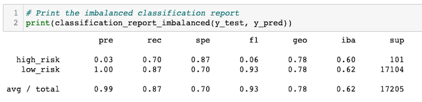

6. Easy Ensemble Classifier

    - Balanced Accuracy Score: The score is really good at 0.93.
        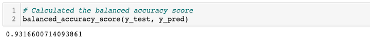

    - Imbalanced Classification Report: The precision score for high risk is very low at 0.01 whereas the recall scores are very good for both high risk and low risk.
        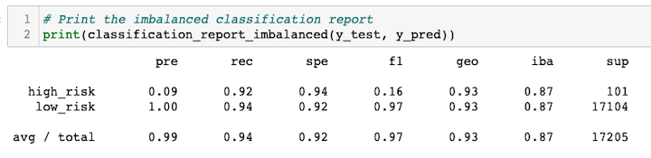

## **Summary**

1. Naive Random Oversampling
    
    - The Random Oversampling model is a bad model as the balanced accuracy score is low and the confusion matrix shows how imbalanced the model is towards low risk vs high risk matrix.

        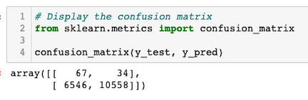

    - This is evident when you look at the precision scores where this model is very bad at predicting high risk but good at predicting low risk.  

    - The recall scores are also not good making this a bad model to predict credit risk.

2. SMOTE Oversampling

    - SMOTE model is also a bad model as the balance accuracy, precision and recall scores are pretty in line with the results from the Random Oversampling model.  

    - Again, the confusion matrix shows how imbalanced this model is.

3. Cluster Centroids Undersampling

    - Cluster Centroids Undersampling model is also a bad model for reasons stated above.  With the balanced accuracy score of 0.55 this is even worse than the oversampling models.

    - The precision scores are also very bad at predicting high risk and the recall scores are low.  

    - Again, the confusion matrix shows how imbalanced this model is.

4. SMOTEENN Combination Sampling

    - Though the scores seem slightly better for the SMOTEEN model than the oversampling and undersampling models, this is still a bad model.  

    - The balanced accuracy score of 0.64 is low as well as the precision scores (for predicting high risk) and the recall scores.  

    - Again, the confusion matrix shows how imbalanced this model is.

5. Balanced Random Forest Classifier

    - Though the balanced accuracy score for the Balanced Random Forest Classifier model is decent at 0.79, the accuracy score is not very important as the data is not balanced as you can see in the confusion matrix below.

        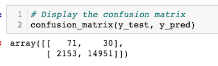

    - Combined with the imbalance and the precision score for high risk being very low making this a bad model.

6. Easy Ensemble Classifier

    - Easy Ensemble Classifier model seems to be a good model on the surface with a high balanced accuracy score and high scores for recall.  However, I would still classify this as a bad model due to the poor high risk precision score and the imbalance of this model.

In summary, I would not recommend any of the 6 models used.  There is a big imbalance and the precision scores for high risk across the board are very low.  If we scale the data, this could be one way to improve performance.  We can also test out different solvers for Logistic Regression to see if it would improve the models' performance.  
